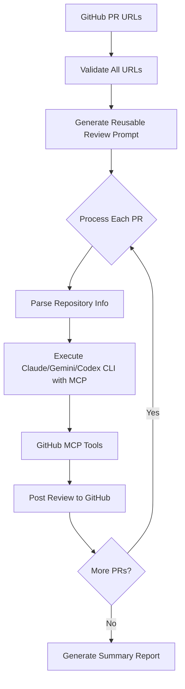

# 🤖 CodeReview MCP (Claude, Gemini & Codex)

[](https://www.gnu.org/licenses/old-licenses/gpl-2.0)

[](https://github.com/sychus/codereview-mcp-claude-code/issues)
[](https://github.com/sychus/codereview-mcp-claude-code/stargazers)

**Automated code review system powered by Claude AI, Gemini, Codex, and GitHub MCP (Model Context Protocol)**

Transform your code review process with intelligent automation that analyzes single or multiple GitHub Pull Requests and provides comprehensive feedback directly through GitHub's interface. Now supports Claude, Gemini, and Codex CLIs in a single unified script with batch processing capabilities.

## 👨‍💻 Author

**sychus** - *Creator and Maintainer*
- GitHub: [@sychus](https://github.com/sychus)
- Repository: [CodeReviewMCP](https://github.com/sychus/CodeReviewMCP)

## ✨ Features

- 🔍 **Automated PR Analysis** - Intelligent analysis of single or multiple GitHub Pull Requests using Claude AI, Gemini, or Codex
- 📊 **Batch Processing** - Process multiple PRs in a single execution with progress tracking and comprehensive summary reports
- 📈 **Comprehensive Reviews** - Detailed feedback on code quality, security, performance, and best practices
- 🚀 **Direct GitHub Integration** - Posts reviews directly to GitHub PRs via MCP tools
- 🎯 **Customizable Guidelines** - Configurable review criteria and focus areas
- 🛡️ **Security-First** - Built-in security vulnerability detection
- ⚡ **CLI Automation** - One-command execution for streamlined workflows
- 🎨 **Rich Output** - Colored terminal output with progress indicators and real-time status updates
- 🔄 **Multi-CLI Support** - Auto-detects Claude, Gemini, and Codex CLIs, lets you choose if multiple are installed
- 🔗 **URL Validation** - Validates all PR URLs before processing to ensure successful batch operations
- 📋 **Smart Resource Management** - Uses a single reusable prompt template for efficiency across multiple PRs

## 🚀 Quick Start

### Prerequisites

- **Node.js** (v18 or higher)
- **Claude CODE** - Install with: `npm install -g @anthropic-ai/claude-code`
- **Gemini CLI** (optional, for Google Gemini support)
- **Codex CLI** (optional, for OpenAI Codex support)
- **Docker** - Required for running MCP servers
- **GitHub Personal Access Token** - For API access
- **GitHub MCP Server** configured with Claude, Gemini, or Codex (see setup below)

### MCP Configuration

Before using this tool, you need to configure the GitHub MCP server with Claude Code, Gemini, or Codex. For detailed instructions, visit the [Claude Code project](https://github.com/anthropics/claude-code), your Gemini CLI documentation, or Codex CLI documentation.

#### 1. **Setup GitHub MCP Server**

First, create a GitHub Personal Access Token:
- Go to GitHub Settings → Developer settings → Personal access tokens → Tokens (classic)
- Generate a new token with the following scopes: `repo`, `pull_requests`, `issues`

Then configure the GitHub MCP server:
```bash
claude mcp add github -s user -e GITHUB_PERSONAL_ACCESS_TOKEN=$MY_GITHUB_ACCESS_TOKEN... -- docker run -i --rm -e GITHUB_PERSONAL_ACCESS_TOKEN ghcr.io/github/github-mcp-server
```
For Gemini, follow the Gemini CLI instructions for MCP setup.
For Codex, configure MCP in your `~/.codex/config.toml` file.

Replace `$MY_GITHUB_ACCESS_TOKEN...` with your actual GitHub Personal Access Token.

#### 2. **Verify MCP Configuration**

Check that the GitHub MCP is properly configured:
```bash
claude mcp list
```
For Gemini:
```bash
gemini mcp list
```
For Codex:
```bash
codex mcp list
```
You should see `github` in the list of configured MCP servers.

### Installation

1. **Clone the repository:**
   ```bash
   git clone git@github.com:sychus/CodeReviewMCP.git
   cd CodeReviewMCP
   ```

2. **Make the script executable:**
   ```bash
   chmod +x codereview.sh
   ```

### Basic Usage

```bash
# Single Pull Request Review
./codereview.sh review.md https://github.com/owner/repo/pull/123

# Multiple Pull Requests Review (NEW!)
./codereview.sh review.md \
  https://github.com/owner1/repo1/pull/123 \
  https://github.com/owner2/repo2/pull/456 \
  https://github.com/owner3/repo3/pull/789
```

The script will:
1. ✅ Validate prerequisites and all PR URLs
2. 🔄 Auto-detect which CLI(s) are installed  
3. ❓ Prompt you to select if multiple are present, or auto-select if only one is available
4. 🔄 Generate a reusable review prompt template
5. 🤖 Process each PR sequentially with progress tracking
6. 📝 Post comprehensive review directly to each GitHub PR
7. 📊 Display final summary report with results

#### Supported CLIs
- If only Claude CLI is installed, it will use Claude.
- If only Gemini CLI is installed, it will use Gemini.
- If only Codex CLI is installed, it will use Codex.
- If multiple CLIs are installed, you will be prompted to choose.

## 📋 How It Works

### 1. **Automated Analysis Pipeline**



### 2. **MCP Tool Integration**

The system uses GitHub MCP tools exclusively:
- `github:get_pull_request` - Fetch PR details
- `github:get_pull_request_files` - Get changed files
- `github:get_file_contents` - Analyze specific files
- `github:create_pull_request_review` - Post reviews

### 3. **Review Process**

1. **URL Validation**: Validates all provided GitHub PR URLs before processing
2. **Template Generation**: Creates a single reusable prompt template for efficiency
3. **Batch Processing**: Processes each PR sequentially with progress tracking
4. **Data Gathering**: For each PR, fetches metadata, changed files, and file contents
5. **Intelligent Analysis**: Claude, Gemini, or Codex analyzes code using configurable guidelines
6. **Review Generation**: Creates structured feedback following best practices
7. **Direct Posting**: Publishes review directly to GitHub with appropriate status
8. **Summary Reporting**: Displays comprehensive results with success/failure statistics

## ⚙️ Configuration

### Review Guidelines (`review.md`)

Customize the review criteria by editing `review.md`:

```markdown
## Technical Focus Areas
1. **Clean Code Principles**
2. **DRY (Don't Repeat Yourself)**  
3. **Performance & Optimization**
4. **Security & Vulnerabilities**
5. **Error Handling & Edge Cases**
```

### Environment Setup

```bash
# Optional: Set Claude config directory
export CLAUDE_CONFIG_DIR="/path/to/your/claude/config"
# Optional: Set Gemini config directory
export GEMINI_CONFIG_DIR="$HOME/.gemini"
# Optional: Set Codex config directory
export CODEX_CONFIG_DIR="$HOME/.codex"
```

## 📚 Examples

### Single PR Review
```bash
./codereview.sh review.md https://github.com/myorg/myapp/pull/42
```

### Multiple PRs Review  
```bash
./codereview.sh review.md \
  https://github.com/myorg/myapp/pull/42 \
  https://github.com/myorg/myapp/pull/43 \
  https://github.com/myorg/myapp/pull/44
```

### Sample Output
```
ℹ️  Validating 3 URL(s)...
✅ All URLs validated successfully
✅ Prerequisites check passed
🔄 Generating reusable review prompt template...
✅ Prompt template created successfully
ℹ️  Starting batch review process for 3 Pull Request(s) using claude

🔄 [1/3] Processing PR: https://github.com/myorg/myapp/pull/42
ℹ️  [1/3] Analyzing: myorg/myapp PR #42
🔄 [1/3] Executing claude for PR #42...
✅ [1/3] ✅ Review completed for PR #42

🔄 [2/3] Processing PR: https://github.com/myorg/myapp/pull/43
ℹ️  [2/3] Analyzing: myorg/myapp PR #43
🔄 [2/3] Executing claude for PR #43...
✅ [2/3] ✅ Review completed for PR #43

🔄 [3/3] Processing PR: https://github.com/myorg/myapp/pull/44
ℹ️  [3/3] Analyzing: myorg/myapp PR #44
🔄 [3/3] Executing claude for PR #44...
✅ [3/3] ✅ Review completed for PR #44

📊 BATCH REVIEW SUMMARY REPORT
═══════════════════════════════════════
📈 Total PRs processed: 3
✅ Successful reviews: 3
❌ Failed reviews: 0
🔧 Tool used: claude

📋 Detailed Results:
  ✅ https://github.com/myorg/myapp/pull/42 - Review posted successfully
  ✅ https://github.com/myorg/myapp/pull/43 - Review posted successfully  
  ✅ https://github.com/myorg/myapp/pull/44 - Review posted successfully

🔗 Check your GitHub PRs for the posted reviews
🎉 All reviews completed successfully!
```

## 🛠️ Advanced Usage

### Custom Review Templates

Create specialized review templates for different project types:

```bash
# Frontend-focused review (single PR)
./codereview.sh templates/frontend-review.md https://github.com/org/ui-repo/pull/15

# Backend API review (multiple PRs)
./codereview.sh templates/api-review.md \
  https://github.com/org/api-repo/pull/28 \
  https://github.com/org/api-repo/pull/29 \
  https://github.com/org/api-repo/pull/30
```

### Real-World Use Cases

```bash
# Daily review routine - multiple PRs from your team
./codereview.sh review.md \
  https://github.com/myorg/backend/pull/156 \
  https://github.com/myorg/frontend/pull/87 \
  https://github.com/myorg/mobile/pull/23

# Release preparation - review all feature PRs
./codereview.sh review.md \
  https://github.com/myorg/project/pull/201 \
  https://github.com/myorg/project/pull/202 \
  https://github.com/myorg/project/pull/203 \
  https://github.com/myorg/project/pull/204 \
  https://github.com/myorg/project/pull/205

# Code review backlog cleanup
./codereview.sh review.md \
  https://github.com/myorg/service/pull/45 \
  https://github.com/myorg/service/pull/46 \
  https://github.com/myorg/service/pull/47 \
  https://github.com/myorg/service/pull/48
```

## 🛠️ Development

### Project Structure

```
codereview-mcp-claude-code/
├── codereview.sh           # Main automation script (Claude, Gemini & Codex)
├── review.md               # Default review guidelines
├── .gitignore              # Git ignore patterns
└── README.md               # This file
```

### Contributing

1. **Fork the repository**
2. **Create a feature branch**: `git checkout -b feature/amazing-feature`
3. **Commit changes**: `git commit -m 'Add amazing feature'`
4. **Push to branch**: `git push origin feature/amazing-feature`
5. **Open a Pull Request**

### Running Tests

```bash
# Test with a sample PR
./codereview.sh review.md https://github.com/octocat/Hello-World/pull/1

# Validate script syntax
bash -n codereview.sh
```

## 🛠️ Troubleshooting

### Common Issues

1. **Claude CLI, Gemini CLI, or Codex CLI not found**
   ```bash
   npm install -g claude-cli
   # or follow Gemini CLI installation instructions
   # or follow Codex CLI installation instructions
   ```

2. **GitHub MCP not configured**
   - Verify with: `claude mcp list`, `gemini mcp list`, or `codex mcp list`
   - If missing, follow the MCP Configuration section above
   - Ensure your GitHub token has correct permissions (`repo`, `pull_requests`, `issues`)

3. **Permission denied**
   ```bash
   chmod +x codereview.sh
   ```

4. **Docker not running**
   - Ensure Docker is installed and running
   - Test with: `docker --version`

5. **GitHub API rate limits**
   - Use a GitHub Personal Access Token for higher rate limits
   - Verify token is not expired

6. **MCP server connection issues**
   ```bash
   # Test MCP connectivity
   claude mcp test github
   # or
   gemini mcp test github
   # or
   codex mcp test github
   
   # Restart MCP server if needed
   claude mcp restart github
   # or
   gemini mcp restart github
   # or
   codex mcp restart github
   ```

For more detailed MCP troubleshooting, refer to the [Claude Code documentation](https://github.com/anthropics/claude-code), Gemini CLI docs, or Codex CLI documentation.

## 📋 Requirements

| Component   | Version | Purpose                        |
|-------------|---------|--------------------------------|
| Claude CLI  | Latest  | AI-powered code analysis       |
| Gemini CLI  | Latest  | AI-powered code analysis       |
| Codex CLI   | Latest  | AI-powered code analysis       |
| Docker      | Latest  | MCP server containerization    |
| Bash        | 4.0+    | Script execution               |
| GitHub MCP  | Latest  | GitHub API integration         |

## 🤝 Contributing

We welcome contributions! Please see our [Contributing Guidelines](CONTRIBUTING.md) for details.

### Areas for Contribution

- 🔄 **CI/CD Integration** - GitHub Actions workflows
- 🎨 **Review Templates** - Specialized review guidelines
- 🛠️ **Tool Integrations** - Support for other code hosting platforms
- 📚 **Documentation** - Examples, tutorials, best practices
- 🐛 **Bug Fixes** - Issues and improvements

## 📄 License

This project is licensed under the GNU GENERAL PUBLIC LICENSE V2 - see the [LICENSE](LICENSE) file for details.

## 🙏 Acknowledgments

- **Claude AI** by Anthropic for powerful code analysis capabilities
- **Gemini** by Google for advanced code review support
- **Codex** by OpenAI for intelligent code understanding
- **Model Context Protocol (MCP)** for seamless tool integration
- **GitHub** for comprehensive API and PR management
- **Open Source Community** for inspiration and best practices

## 📞 Support

- **Issues**: [GitHub Issues](https://github.com/sychus/codereview-mcp-claude-code/issues)
- **Discussions**: [GitHub Discussions](https://github.com/sychus/codereview-mcp-claude-code/discussions)
- **Documentation**: [Wiki](https://github.com/sychus/codereview-mcp-claude-code/wiki)

## 🔗 Related Projects

- [Claude CODE](https://github.com/anthropics/claude-code) - Command-line interface for Claude
- [MCP Servers](https://github.com/modelcontextprotocol/servers) - Official MCP server implementations

---

**Made with ❤️ by sychus and the open source community**
