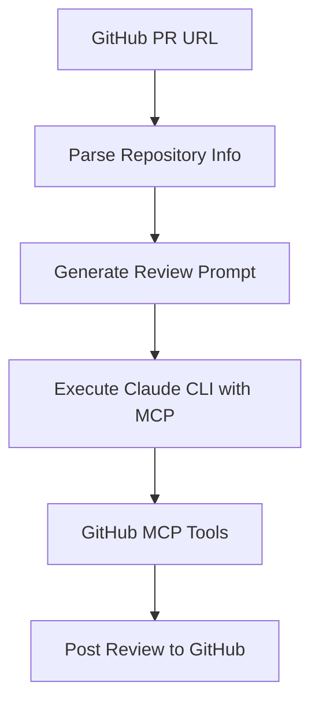

# 🤖 CodeReview MCP Claude

[](https://opensource.org/licenses/MIT)
[](https://github.com/sychus/codereview-mcp-claude-code/issues)
[](https://github.com/sychus/codereview-mcp-claude-code/stargazers)

**Automated code review system powered by Claude AI and GitHub MCP (Model Context Protocol)**

Transform your code review process with intelligent automation that analyzes GitHub Pull Requests and provides comprehensive feedback directly through GitHub's interface.

## 👨‍💻 Author

**sychus** - *Creator and Maintainer*
- GitHub: [@sychus](https://github.com/sychus)
- Repository: [codereview-mcp-claude-code](https://github.com/sychus/codereview-mcp-claude-code)

## ✨ Features

- 🔍 **Automated PR Analysis** - Intelligent analysis of GitHub Pull Requests using Claude AI
- 📊 **Comprehensive Reviews** - Detailed feedback on code quality, security, performance, and best practices
- 🚀 **Direct GitHub Integration** - Posts reviews directly to GitHub PRs via MCP tools
- 🎯 **Customizable Guidelines** - Configurable review criteria and focus areas
- 🛡️ **Security-First** - Built-in security vulnerability detection
- ⚡ **CLI Automation** - One-command execution for streamlined workflows
- 🎨 **Rich Output** - Colored terminal output with progress indicators

## 🚀 Quick Start

### Prerequisites

- **Node.js** (v16 or higher)
- **Claude CLI** - Install with: `npm install -g claude-cli`
- **GitHub MCP Server** configured with Claude

### Installation

1. **Clone the repository:**
   ```bash
   git clone https://github.com/sychus/codereview-mcp-claude-code.git
   cd codereview-mcp-claude-code
   ```

2. **Make the script executable:**
   ```bash
   chmod +x codereview.sh
   ```

3. **Setup Claude CLI with GitHub MCP:**
   ```bash
   # Configure Claude CLI with your GitHub MCP server
   claude config set mcp.github.enabled true
   ```

### Basic Usage

```bash
# Review a GitHub Pull Request
./codereview.sh review.md https://github.com/owner/repo/pull/123
```

The script will:
1. ✅ Validate prerequisites (Claude CLI)
2. 🔄 Generate automated review prompt with MCP instructions
3. 🤖 Execute Claude with GitHub MCP tools
4. 📝 Post comprehensive review directly to the GitHub PR

## 📋 How It Works

### 1. **Automated Analysis Pipeline**



### 2. **MCP Tool Integration**

The system uses GitHub MCP tools exclusively:
- `github:get_pull_request` - Fetch PR details
- `github:get_pull_request_files` - Get changed files
- `github:get_file_contents` - Analyze specific files
- `github:create_pull_request_review` - Post reviews

### 3. **Review Process**

1. **Data Gathering**: Fetches PR metadata, changed files, and file contents
2. **Intelligent Analysis**: Claude analyzes code using configurable guidelines
3. **Review Generation**: Creates structured feedback following best practices
4. **Direct Posting**: Publishes review directly to GitHub with appropriate status

## ⚙️ Configuration

### Review Guidelines (`review.md`)

Customize the review criteria by editing `review.md`:

```markdown
## Technical Focus Areas
1. **Clean Code Principles**
2. **DRY (Don't Repeat Yourself)**  
3. **Performance & Optimization**
4. **Security & Vulnerabilities**
5. **Error Handling & Edge Cases**
```

### Environment Setup

```bash
# Optional: Set Claude config directory
export CLAUDE_CONFIG_DIR="/path/to/your/claude/config"
```

## 📖 Examples

### Basic PR Review
```bash
./codereview.sh review.md https://github.com/myorg/myapp/pull/42
```

### Sample Output
```
ℹ️  Analyzing URL: https://github.com/myorg/myapp/pull/42
✅ Detected Pull Request: myorg/myapp PR #42
🔄 Checking prerequisites...
✅ Prerequisites check passed (Claude CLI ready)
🔄 Generating automated review prompt...
✅ Automated prompt created: .codereview_prompt.md
🔄 Executing claude-cli with MCP GitHub...
✅ Claude CLI executed successfully
ℹ️  Check your GitHub PR for the posted review
```

## 🔧 Advanced Usage

### Custom Review Templates

Create specialized review templates for different project types:

```bash
# Frontend-focused review
./codereview.sh templates/frontend-review.md https://github.com/org/ui-repo/pull/15

# Backend API review  
./codereview.sh templates/api-review.md https://github.com/org/api-repo/pull/28
```

### Batch Processing

Process multiple PRs:

```bash
# Create a simple batch script
for pr in 123 124 125; do
  ./codereview.sh review.md https://github.com/myorg/myapp/pull/$pr
done
```

## 🛠️ Development

### Project Structure

```
codereview-mcp-claude-code/
├── codereview.sh           # Main automation script
├── review.md               # Default review guidelines
├── .gitignore             # Git ignore patterns
└── README.md              # This file
```

### Contributing

1. **Fork the repository**
2. **Create a feature branch**: `git checkout -b feature/amazing-feature`
3. **Commit changes**: `git commit -m 'Add amazing feature'`
4. **Push to branch**: `git push origin feature/amazing-feature`
5. **Open a Pull Request**

### Running Tests

```bash
# Test with a sample PR
./codereview.sh review.md https://github.com/octocat/Hello-World/pull/1

# Validate script syntax
bash -n codereview.sh
```

## 📋 Requirements

| Component | Version | Purpose |
|-----------|---------|---------|
| Claude CLI | Latest | AI-powered code analysis |
| Bash | 4.0+ | Script execution |
| GitHub MCP | Latest | GitHub API integration |

## 🤝 Contributing

We welcome contributions! Please see our [Contributing Guidelines](CONTRIBUTING.md) for details.

### Areas for Contribution

- 🔄 **CI/CD Integration** - GitHub Actions workflows
- 🎨 **Review Templates** - Specialized review guidelines
- 🔧 **Tool Integrations** - Support for other code hosting platforms
- 📚 **Documentation** - Examples, tutorials, best practices
- 🐛 **Bug Fixes** - Issues and improvements

## 📄 License

This project is licensed under the MIT License - see the [LICENSE](LICENSE) file for details.

## 🙏 Acknowledgments

- **Claude AI** by Anthropic for powerful code analysis capabilities
- **Model Context Protocol (MCP)** for seamless tool integration
- **GitHub** for comprehensive API and PR management
- **Open Source Community** for inspiration and best practices

## 📞 Support

- **Issues**: [GitHub Issues](https://github.com/sychus/codereview-mcp-claude-code/issues)
- **Discussions**: [GitHub Discussions](https://github.com/sychus/codereview-mcp-claude-code/discussions)
- **Documentation**: [Wiki](https://github.com/sychus/codereview-mcp-claude-code/wiki)

## 🔗 Related Projects

- [Claude CLI](https://github.com/anthropics/claude-cli) - Command-line interface for Claude
- [MCP Servers](https://github.com/modelcontextprotocol/servers) - Official MCP server implementations
- [GitHub CLI](https://github.com/cli/cli) - GitHub's official CLI tool

---

**Made with ❤️ by sychus and the open source community**

[](https://star-history.com/#sychus/codereview-mcp-claude-code&Date)
