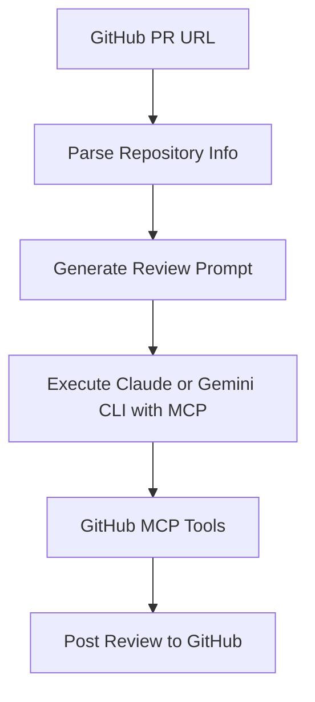

# 🤖 CodeReview MCP (Claude & Gemini)

[](https://opensource.org/licenses/MIT)
[](https://github.com/sychus/codereview-mcp-claude-code/issues)
[](https://github.com/sychus/codereview-mcp-claude-code/stargazers)

**Automated code review system powered by Claude AI, Gemini, and GitHub MCP (Model Context Protocol)**

Transform your code review process with intelligent automation that analyzes GitHub Pull Requests and provides comprehensive feedback directly through GitHub's interface. Now supports both Claude and Gemini CLIs in a single unified script.

## 👨‍💻 Author

**sychus** - *Creator and Maintainer*
- GitHub: [@sychus](https://github.com/sychus)
- Repository: [CodeReviewMCP](https://github.com/sychus/CodeReviewMCP)

## ✨ Features

- 🔍 **Automated PR Analysis** - Intelligent analysis of GitHub Pull Requests using Claude AI or Gemini
- 📈 **Comprehensive Reviews** - Detailed feedback on code quality, security, performance, and best practices
- 🚀 **Direct GitHub Integration** - Posts reviews directly to GitHub PRs via MCP tools
- 🎯 **Customizable Guidelines** - Configurable review criteria and focus areas
- 🛡️ **Security-First** - Built-in security vulnerability detection
- ⚡ **CLI Automation** - One-command execution for streamlined workflows
- 🎨 **Rich Output** - Colored terminal output with progress indicators
- 🔄 **Multi-CLI Support** - Auto-detects Claude and Gemini CLIs, lets you choose if both are installed

## 🚀 Quick Start

### Prerequisites

- **Node.js** (v18 or higher)
- **Claude CODE** - Install with: `npm install -g @anthropic-ai/claude-code`
- **Gemini CLI** (optional, for Google Gemini support)
- **Docker** - Required for running MCP servers
- **GitHub Personal Access Token** - For API access
- **GitHub MCP Server** configured with Claude or Gemini (see setup below)

### MCP Configuration

Before using this tool, you need to configure the GitHub MCP server with Claude Code or Gemini. For detailed instructions, visit the [Claude Code project](https://github.com/anthropics/claude-code) or your Gemini CLI documentation.

#### 1. **Setup GitHub MCP Server**

First, create a GitHub Personal Access Token:
- Go to GitHub Settings → Developer settings → Personal access tokens → Tokens (classic)
- Generate a new token with the following scopes: `repo`, `pull_requests`, `issues`

Then configure the GitHub MCP server:
```bash
claude mcp add github -s user -e GITHUB_PERSONAL_ACCESS_TOKEN=$MY_GITHUB_ACCESS_TOKEN... -- docker run -i --rm -e GITHUB_PERSONAL_ACCESS_TOKEN ghcr.io/github/github-mcp-server
```
Or for Gemini, follow the Gemini CLI instructions for MCP setup.

Replace `$MY_GITHUB_ACCESS_TOKEN...` with your actual GitHub Personal Access Token.

#### 2. **Verify MCP Configuration**

Check that the GitHub MCP is properly configured:
```bash
claude mcp list
```
Or for Gemini:
```bash
gemini mcp list
```
You should see `github` in the list of configured MCP servers.

### Installation

1. **Clone the repository:**
   ```bash
   git clone git@github.com:sychus/CodeReviewMCP.git
   cd CodeReviewMCP
   ```

2. **Make the script executable:**
   ```bash
   chmod +x codereview.sh
   ```

### Basic Usage

```bash
# Review a GitHub Pull Request
./codereview.sh review.md https://github.com/owner/repo/pull/123
```

The script will:
1. ✅ Validate prerequisites (Claude CLI and/or Gemini CLI)
2. 🔄 Auto-detect which CLI(s) are installed
3. ❓ Prompt you to select if both are present, or auto-select if only one is available
4. 🔄 Generate automated review prompt with MCP instructions
5. 🤖 Execute the selected CLI with GitHub MCP tools
6. 📝 Post comprehensive review directly to the GitHub PR

#### Supported CLIs
- If only Claude CLI is installed, it will use Claude.
- If only Gemini CLI is installed, it will use Gemini.
- If both are installed, you will be prompted to choose.

## 📋 How It Works

### 1. **Automated Analysis Pipeline**



### 2. **MCP Tool Integration**

The system uses GitHub MCP tools exclusively:
- `github:get_pull_request` - Fetch PR details
- `github:get_pull_request_files` - Get changed files
- `github:get_file_contents` - Analyze specific files
- `github:create_pull_request_review` - Post reviews

### 3. **Review Process**

1. **Data Gathering**: Fetches PR metadata, changed files, and file contents
2. **Intelligent Analysis**: Claude or Gemini analyzes code using configurable guidelines
3. **Review Generation**: Creates structured feedback following best practices
4. **Direct Posting**: Publishes review directly to GitHub with appropriate status

## ⚙️ Configuration

### Review Guidelines (`review.md`)

Customize the review criteria by editing `review.md`:

```markdown
## Technical Focus Areas
1. **Clean Code Principles**
2. **DRY (Don't Repeat Yourself)**  
3. **Performance & Optimization**
4. **Security & Vulnerabilities**
5. **Error Handling & Edge Cases**
```

### Environment Setup

```bash
# Optional: Set Claude config directory
export CLAUDE_CONFIG_DIR="/path/to/your/claude/config"
# Optional: Set Gemini config directory
export GEMINI_CONFIG_DIR="$HOME/.gemini"
```

## 📚 Examples

### Basic PR Review
```bash
./codereview.sh review.md https://github.com/myorg/myapp/pull/42
```

### Sample Output
```
ℹ️  Analyzing URL: https://github.com/myorg/myapp/pull/42
✅ Detected Pull Request: myorg/myapp PR #42
🔄 Checking prerequisites...
✅ Prerequisites check passed (Claude or Gemini CLI ready)
🔄 Generating automated review prompt...
✅ Automated prompt created: .codereview_prompt.md
🔄 Executing selected CLI with MCP GitHub...
✅ CLI executed successfully
ℹ️  Check your GitHub PR for the posted review
```

## 🛠️ Advanced Usage

### Custom Review Templates

Create specialized review templates for different project types:

```bash
# Frontend-focused review
./codereview.sh templates/frontend-review.md https://github.com/org/ui-repo/pull/15

# Backend API review  
./codereview.sh templates/api-review.md https://github.com/org/api-repo/pull/28
```

### Batch Processing

Process multiple PRs:

```bash
# Create a simple batch script
for pr in 123 124 125; do
  ./codereview.sh review.md https://github.com/myorg/myapp/pull/$pr
done
```

## 🛠️ Development

### Project Structure

```
codereview-mcp-claude-code/
├── codereview.sh           # Main automation script (Claude & Gemini)
├── review.md               # Default review guidelines
├── .gitignore              # Git ignore patterns
└── README.md               # This file
```

### Contributing

1. **Fork the repository**
2. **Create a feature branch**: `git checkout -b feature/amazing-feature`
3. **Commit changes**: `git commit -m 'Add amazing feature'`
4. **Push to branch**: `git push origin feature/amazing-feature`
5. **Open a Pull Request**

### Running Tests

```bash
# Test with a sample PR
./codereview.sh review.md https://github.com/octocat/Hello-World/pull/1

# Validate script syntax
bash -n codereview.sh
```

## 🛠️ Troubleshooting

### Common Issues

1. **Claude CLI or Gemini CLI not found**
   ```bash
   npm install -g claude-cli
   # or follow Gemini CLI installation instructions
   ```

2. **GitHub MCP not configured**
   - Verify with: `claude mcp list` or `gemini mcp list`
   - If missing, follow the MCP Configuration section above
   - Ensure your GitHub token has correct permissions (`repo`, `pull_requests`, `issues`)

3. **Permission denied**
   ```bash
   chmod +x codereview.sh
   ```

4. **Docker not running**
   - Ensure Docker is installed and running
   - Test with: `docker --version`

5. **GitHub API rate limits**
   - Use a GitHub Personal Access Token for higher rate limits
   - Verify token is not expired

6. **MCP server connection issues**
   ```bash
   # Test MCP connectivity
   claude mcp test github
   # or
   gemini mcp test github
   
   # Restart MCP server if needed
   claude mcp restart github
   # or
   gemini mcp restart github
   ```

For more detailed MCP troubleshooting, refer to the [Claude Code documentation](https://github.com/anthropics/claude-code) or Gemini CLI docs.

## 📋 Requirements

| Component   | Version | Purpose                        |
|-------------|---------|--------------------------------|
| Claude CLI  | Latest  | AI-powered code analysis       |
| Gemini CLI  | Latest  | AI-powered code analysis       |
| Docker      | Latest  | MCP server containerization    |
| Bash        | 4.0+    | Script execution               |
| GitHub MCP  | Latest  | GitHub API integration         |

## 🤝 Contributing

We welcome contributions! Please see our [Contributing Guidelines](CONTRIBUTING.md) for details.

### Areas for Contribution

- 🔄 **CI/CD Integration** - GitHub Actions workflows
- 🎨 **Review Templates** - Specialized review guidelines
- 🛠️ **Tool Integrations** - Support for other code hosting platforms
- 📚 **Documentation** - Examples, tutorials, best practices
- 🐛 **Bug Fixes** - Issues and improvements

## 📄 License

This project is licensed under the GNU GENERAL PUBLIC LICENSE V2 - see the [LICENSE](LICENSE) file for details.

## 🙏 Acknowledgments

- **Claude AI** by Anthropic for powerful code analysis capabilities
- **Gemini** by Google for advanced code review support
- **Model Context Protocol (MCP)** for seamless tool integration
- **GitHub** for comprehensive API and PR management
- **Open Source Community** for inspiration and best practices

## 📞 Support

- **Issues**: [GitHub Issues](https://github.com/sychus/codereview-mcp-claude-code/issues)
- **Discussions**: [GitHub Discussions](https://github.com/sychus/codereview-mcp-claude-code/discussions)
- **Documentation**: [Wiki](https://github.com/sychus/codereview-mcp-claude-code/wiki)

## 🔗 Related Projects

- [Claude CODE](https://github.com/anthropics/claude-code) - Command-line interface for Claude
- [MCP Servers](https://github.com/modelcontextprotocol/servers) - Official MCP server implementations

---

**Made with ❤️ by sychus and the open source community**
